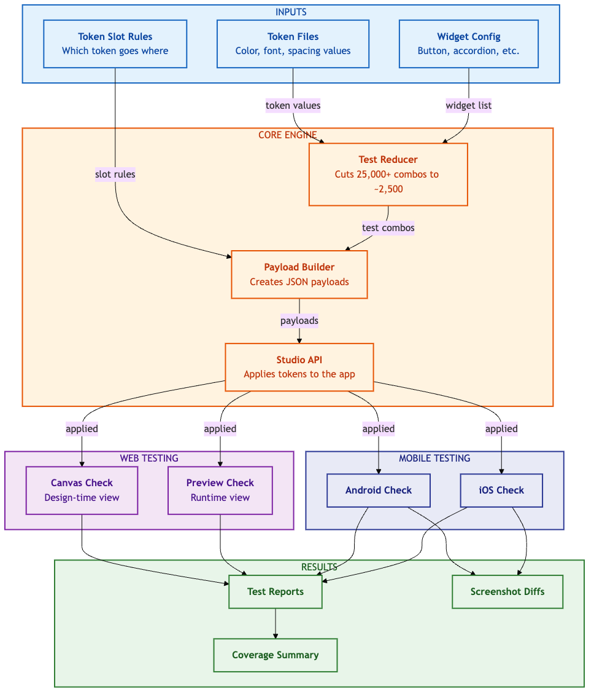

# Style Workspace Automation

**Token-driven test automation framework for validating WaveMaker Studio's Style Workspace across Web (Canvas + Preview) and Mobile (Android + iOS) platforms.**

---

## Why This Framework Exists

WaveMaker Studio's Style Workspace allows designers to customize widget appearances using design tokens. With 44+ widgets, each having multiple appearances, variants, states, and 14 token types, the total number of possible combinations exceeds **25,000**. Manual testing is impractical.

This framework uses **orthogonal array testing** to reduce the test space by ~90%, achieving comprehensive pairwise coverage with only ~2,500 test cases while catching rendering regressions with 70-95% confidence.

---

## Key Features

- **Orthogonal Matrix Testing** -- Reduces 25,000+ combinations to ~250 tests using mathematical optimization
- **Dual-Platform Coverage** -- Validates tokens on Web (Playwright) and Mobile (WebDriverIO/Appium)
- **Four Runtime Targets** -- Canvas, Web Preview, Android, and iOS
- **Visual Regression** -- Screenshot comparison with `pixelmatch` and Playwright snapshots
- **Batch Build Strategy** -- Builds 2 mobile apps (baseline + actual) instead of N, achieving 5-10x speed improvement
- **Parallel Execution** -- Supports parallel emulators and BrowserStack cloud testing
- **Automated Reporting** -- Allure reports, Playwright HTML reports, and token coverage reports

---

## Architecture Overview



---

## Quick Start

### 1. Install Dependencies

```bash
git clone <repository-url>
cd style-workspace-automation
npm install
npx playwright install
```

### 2. Configure Environment

```bash
cp .env.example .env
# Edit .env with your Studio credentials and project details
```

### 3. Run Tests

```bash
# Web tests (Playwright)
npm test

# Mobile tests (WebDriverIO + BrowserStack)
npm run test:mobile

# Slot validation tests
npm run test:slots
```

---

## Tech Stack

| Layer | Technology | Purpose |
|-------|-----------|---------|
| Web Testing | Playwright | Canvas and Preview validation |
| Mobile Testing | WebDriverIO + Appium | Android and iOS validation |
| Cloud Devices | BrowserStack | Remote mobile device execution |
| Visual Regression | pixelmatch + Playwright Snapshots | Screenshot comparison |
| Reporting | Allure + Playwright HTML | Test result reporting |
| API Client | Axios | WaveMaker Studio API interaction |
| Language | TypeScript | Type-safe test automation |
| Build Tools | ts-node | Direct TypeScript execution |
| Token Schema | Zod | Token file validation |
| Logging | Winston | Structured logging |
| CI Artifacts | AWS S3 | Report storage and distribution |

---

## Project Structure

```
style-workspace-automation/
├── src/                          # Core framework source code
│   ├── api/                      # Studio API client and RN project manager
│   ├── matrix/                   # Orthogonal matrix generator and widget configs
│   ├── playwright/               # Playwright helpers, reporters, slot generator
│   ├── tokens/                   # Token loader, mapping service, schema
│   └── utils/                    # Environment config, logger
├── tests/                        # Playwright test specs
│   ├── global-setup.ts           # Authentication, baselines, token selection
│   ├── token_apply_and_validate.spec.ts   # Main web validation suite
│   ├── token_slot_validation.spec.ts      # Slot-based validation
│   └── testdata/mobile/          # CSV test data for mobile widgets
├── wdio/                         # WebDriverIO mobile framework
│   ├── config/                   # WDIO configs (shared, BrowserStack, local)
│   ├── specs/                    # Mobile test specs (30+ widgets)
│   ├── components/               # Page Object Model components
│   ├── helpers/                  # Screenshot and verification helpers
│   └── utils/                    # Mobile mapper, test data loader
├── tokens/                       # Design token definitions
│   ├── web/                      # Web token files (per component)
│   └── mobile/                   # Mobile token files (global + component)
├── scripts/                      # Build, upload, and utility scripts
├── screenshots/                  # Baseline, actual, and diff images
├── artifacts/                    # Test results and reports
├── mobile-builds/                # Android APK and iOS IPA outputs
├── .test-cache/                  # Cached payloads, auth state, app URLs
├── playwright.config.ts          # Playwright configuration
├── .env.example                  # Environment variable template
└── package.json                  # Scripts and dependencies
```

---

## Available NPM Scripts

### Web Testing (Playwright)

| Script | Description |
|--------|-------------|
| `npm test` | Run all Playwright tests |
| `npm run test:headed` | Run with visible browser |
| `npm run test:slots` | Run token slot validation |
| `npm run test:canvas` | Validate Canvas only |
| `npm run test:preview` | Validate Preview only |

### Mobile Testing (WebDriverIO)

| Script | Description |
|--------|-------------|
| `npm run test:mobile` | Run mobile tests on BrowserStack (Android) |
| `npm run test:mobile:full` | Full suite: setup + Android + iOS |
| `npm run test:mobile:android` | Local Android emulator |
| `npm run test:mobile:ios` | BrowserStack iOS |
| `npm run test:mobile:setup` | Build and upload mobile apps |

### Utilities

| Script | Description |
|--------|-------------|
| `npm run build:token-map` | Generate token value mappings |
| `npm run build:mobile` | Build mobile apps locally |
| `npm run allure:generate` | Generate Allure HTML report |
| `npm run allure:open` | Open Allure report in browser |
| `npm run uploadS3` | Upload reports to S3 |

---

## Documentation

| Document | Description |
|----------|-------------|
| [Getting Started](docs/01-GETTING-STARTED.md) | Prerequisites, installation, first test run |
| [Framework Overview](docs/02-FRAMEWORK-OVERVIEW.md) | What this framework does and key concepts |
| [Architecture Deep Dive](docs/03-ARCHITECTURE-DEEP-DIVE.md) | Matrix generation, payloads, CSS verification |
| [Adding New Widgets](docs/04-ADDING-NEW-WIDGETS.md) | Step-by-step widget integration guide |
| [Web Testing Guide](docs/05-WEB-TESTING-GUIDE.md) | Playwright testing for Canvas and Preview |
| [Mobile Testing Guide](docs/06-MOBILE-TESTING-GUIDE.md) | WebDriverIO testing for Android and iOS |
| [Configuration Reference](docs/07-CONFIGURATION-REFERENCE.md) | All environment variables and config files |
| [Troubleshooting and FAQ](docs/08-TROUBLESHOOTING-AND-FAQ.md) | Common issues, debugging, and FAQ |

---

## Supported Widgets (44)

button, accordion, label, panel, cards, formcontrols, form-wrapper, navbar, picture, carousel, tabbar, bottomsheet, barcodescanner, tabs, list, chips, radioset, checkbox, checkboxset, toggle, switch, wizard, container, tile, button-group, anchor, webview, spinner, search, progress-bar, progress-circle, dropdown-menu, popover, login, calendar, slider, rating, icon, lottie, audio, message, modal-dialog, fileupload

---

## License

ISC
