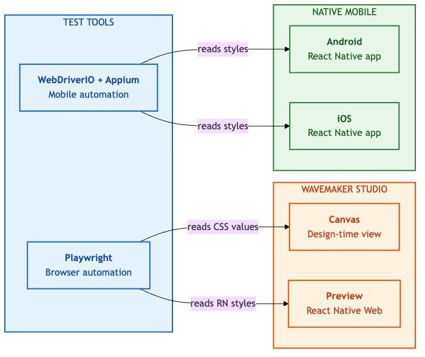
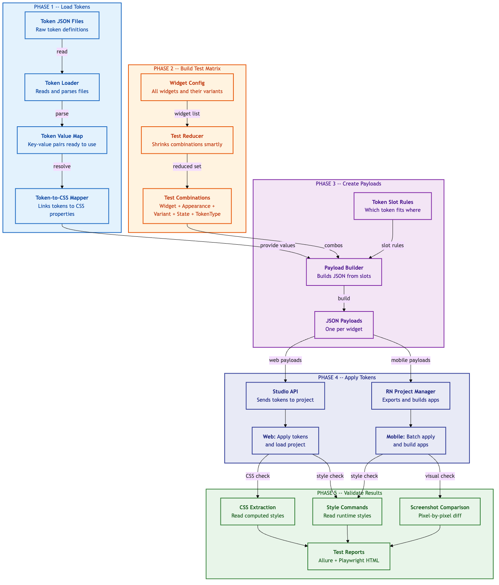

# Framework Overview

This document explains what the Style Workspace Automation framework is, the problem it solves, and the key concepts you need to understand before working with it.

---

## Table of Contents

1. [What Is This Framework](#what-is-this-framework)
2. [The Problem](#the-problem)
3. [The Solution](#the-solution)
4. [Key Concepts](#key-concepts)
5. [Platform Coverage](#platform-coverage)
6. [End-to-End Data Flow](#end-to-end-data-flow)
7. [Test Execution Strategies](#test-execution-strategies)

---

## What Is This Framework

Style Workspace Automation is a **token-driven test automation framework** built to validate WaveMaker Studio's Style Workspace. It ensures that design tokens (colors, fonts, borders, spacing, etc.) are correctly applied and rendered across all supported platforms.

The framework is built on two testing pillars:

- **Playwright** for web validation (Studio Canvas and Web Preview)
- **WebDriverIO + Appium** for mobile validation (Android and iOS native apps)

---

## The Problem

WaveMaker Studio's Style Workspace allows users to customize widget appearances through design tokens. The challenge is the **combinatorial explosion** of test cases:

```
44 widgets
  x 2-5 appearances per widget
  x 2-12 variants per appearance
  x 2-3 states per widget
  x 14 token types
  = 25,000+ unique combinations
```

Manual testing of 25,000+ combinations is:

- **Time-prohibitive**: Days or weeks per release cycle
- **Error-prone**: Human reviewers miss subtle rendering differences
- **Incomplete**: Usually only a subset of widgets gets tested
- **Inconsistent**: Different testers evaluate rendering differently

---

## The Solution

This framework applies three strategies to make comprehensive testing practical:

### 1. Orthogonal Array Testing

Instead of testing every combination (full Cartesian product), the framework uses **orthogonal arrays** to select a mathematically optimal subset that guarantees **pairwise coverage** -- every pair of parameter values appears in at least one test case.

```
Full Cartesian:     25,000+ test cases
Orthogonal Array:   ~2500 test cases
Reduction:          ~90%
Confidence:         80-95% defect detection
```

### 2. Batch Build Strategy (Mobile)

Instead of building a separate mobile app for each token change:

```
Naive approach:     N builds (one per token) = hours of build time
Batch approach:     2 builds (baseline + actual) = minutes
Speedup:            5-10x faster
```

The framework merges all token changes into a single batch payload, applies them all at once, and builds one "actual" app with all tokens applied.

### 3. Automated Visual Regression

Rather than relying on human judgment, the framework uses pixel-level comparison:

- **Web**: Playwright's built-in `toHaveScreenshot()` with configurable thresholds
- **Mobile**: Custom `pixelmatch` comparison with diff image generation

---

## Key Concepts

Understanding these concepts is essential for working with the framework.

### Widgets

A **widget** is a UI component in WaveMaker Studio (e.g., button, accordion, label, panel). The framework supports 44 widgets, each defined in `src/matrix/widgets.ts`.

### Appearances

An **appearance** is a visual style variant of a widget. For example, a button has four appearances:

- `filled` -- Solid background color
- `outlined` -- Border only, transparent background
- `text` -- Text only, no background or border
- `elevated` -- Raised with shadow

### Variants

A **variant** is a sub-style within an appearance. For example, under the `filled` appearance, a button can have variants like `primary`, `secondary`, `success`, `warning`, `error`.

### States

A **state** represents an interactive condition of the widget. Common states include:

- `default` -- Normal resting state
- `disabled` -- Non-interactive state
- `hover` -- Mouse hover (web only)
- `focused` -- Keyboard focus
- `active` -- Currently selected/pressed

### Token Types

A **token type** represents a category of CSS property that can be customized. The framework supports 14 token types.

**Where token types are defined:**

- **Type definition**: `src/matrix/widgets.ts` -- the `TokenType` union type lists all available types
- **Active list**: `src/matrix/generator.ts` -- the `TOKEN_TYPES` array lists the types used by the matrix generator
- **Token files**: `tokens/web/components/` and `tokens/mobile/global/` -- the actual token JSON files whose file names and content reflect the available categories

| Token Type | CSS Properties | Example Token Reference |
|-----------|---------------|---------|
| `color` | background-color, color, border-color | `{color.background.btn.primary.default.value}` |
| `font` | font-size, font-family, font-weight, line-height | `{font.body.fontSize.value}` |
| `border-width` | border-width | `{border-width.sm.value}` |
| `border-style` | border-style | `{border-style.solid.value}` |
| `border-radius` | border-radius | `{border-radius.md.value}` |
| `margin` | margin | `{margin.md.value}` |
| `padding` / `space` / `spacer` | padding, height, width | `{space.md.value}` |
| `gap` | gap | `{gap.sm.value}` |
| `elevation` / `box-shadow` | box-shadow | `{elevation.md.value}` |
| `opacity` | opacity | `{opacity.50.value}` |
| `icon` | icon-size | `{icon.size.md.value}` |
| `asterisk-color` | asterisk color in form fields | `{color.asterisk.value}` |

Each widget declares which token types it supports via the `allowedTokenTypes` array in its config (`src/matrix/widgets.ts`). The matrix generator only produces test combinations for allowed types. See the [Adding New Widgets guide](04-ADDING-NEW-WIDGETS.md#where-to-find-available-token-types) for details on how to determine which types a widget supports.

### Token Slots

A **token slot** is a specific property on a specific widget that accepts a token. Token slots are defined in `wdio/config/widget-token-slots.json` and serve as the **source of truth** for what properties each widget supports.

Example token slot definition:

```json
{
  "button": {
    "tokenSlots": [
      { "tokenType": "color", "properties": ["background", "color", "border.color"] },
      { "tokenType": "font", "properties": ["font-size", "font-weight", "line-height", "letter-spacing", "font-family"] },
      { "tokenType": "border-radius", "properties": ["radius"] },
      { "tokenType": "border-width", "properties": ["border.width"] },
      { "tokenType": "space", "properties": ["padding.top", "padding.bottom", "padding.left", "padding.right", "height", "min-width"] },
      { "tokenType": "elevation", "properties": ["shadow"] },
      { "tokenType": "opacity", "properties": ["opacity"] },
      { "tokenType": "gap", "properties": ["gap"] },
      { "tokenType": "icon", "properties": ["icon-size"] }
    ]
  }
}
```

### Matrix Items

A **matrix item** represents one test case -- a specific combination of widget, appearance, variant, state, and token type:

```typescript
interface MatrixItem {
  widget: Widget;        // e.g., 'button'
  appearance: Appearance; // e.g., 'filled'
  variant: Variant;      // e.g., 'primary'
  state: State;          // e.g., 'default'
  tokenType: TokenType;  // e.g., 'color'
}
```

### Payloads

A **payload** is the JSON data structure sent to the Studio API to apply a token. Different widgets use different payload structures:

| Structure Type | Widgets | Format |
|---------------|---------|--------|
| `direct-mapping` | accordion, anchor, webview | `{ widget: { mapping: {...} } }` |
| `hybrid-mapping` | navbar | Both root-level and appearance-specific mappings |
| `appearance-mapping` | cards | `{ widget: { appearances: { [app]: { mapping: {...} } } } }` |
| `variant-groups` | button, panel, and most others | `{ widget: { appearances: { [app]: { variantGroups: {...} } } } }` |

---

## Platform Coverage

The framework validates token rendering across four distinct runtime environments:



### Canvas (Web - Design Time)

- **Tool**: Playwright
- **Environment**: WaveMaker Studio's design canvas
- **Verification Method**: `getComputedStyle()` via `page.$eval()`
- **Selectors**: XPath selectors from `src/matrix/widget-xpaths.ts`

### Preview (Web - React Native Web)

- **Tool**: Playwright
- **Environment**: Studio's preview mode (React Native Web runtime)
- **Verification Method**: RN style commands via style inspector
- **Command Format**: `App.appConfig.currentPage.Widgets.{name}._INSTANCE.styles.{path}`

### Android (Mobile - React Native)

- **Tool**: WebDriverIO + Appium (UiAutomator2)
- **Environment**: Native Android app on emulator or BrowserStack device
- **Verification Method**: RN style commands via accessibility IDs + screenshot comparison

### iOS (Mobile - React Native)

- **Tool**: WebDriverIO + Appium (XCUITest)
- **Environment**: Native iOS app on simulator or BrowserStack device
- **Verification Method**: RN style commands via accessibility IDs + screenshot comparison

---

## End-to-End Data Flow

This diagram shows how data flows from token files to test validation:



---

## Test Execution Strategies

### Web Tests: One-at-a-Time Strategy

For web tests (Playwright), tokens are applied **individually**:

1. Select a token from the global token pool
2. Generate a payload for one widget-variant-token combination
3. Apply the token via Studio API
4. Publish and deploy
5. Navigate to the widget on Canvas or Preview
6. Extract the CSS value and compare with expected
7. Rollback the token
8. Repeat for the next test case

This approach is slower but provides **precise per-token validation**.

### Mobile Tests: Batch Build Strategy

For mobile tests (WebDriverIO), tokens are applied **in bulk**:

1. Build a **baseline app** with default (no custom) tokens
2. Generate a **batch payload** merging all tokens for all widgets
3. Apply the batch payload via Studio API
4. Build an **actual app** with all tokens applied
5. Upload both apps to BrowserStack (or install on local emulator)
6. For each widget variant:
   - Capture screenshot on baseline app
   - Capture screenshot on actual app
   - Compare screenshots (pixelmatch)
   - Extract RN styles and verify values

This approach is **5-10x faster** because it avoids rebuilding the app for each token.

---

## Next Steps

- [Architecture Deep Dive](03-ARCHITECTURE-DEEP-DIVE.md) -- Detailed technical documentation of matrix generation, payload creation, and CSS verification
- [Adding New Widgets](04-ADDING-NEW-WIDGETS.md) -- How to integrate new widgets into the framework
- [Web Testing Guide](05-WEB-TESTING-GUIDE.md) -- Running and debugging Playwright tests
- [Mobile Testing Guide](06-MOBILE-TESTING-GUIDE.md) -- Running and debugging WebDriverIO tests
