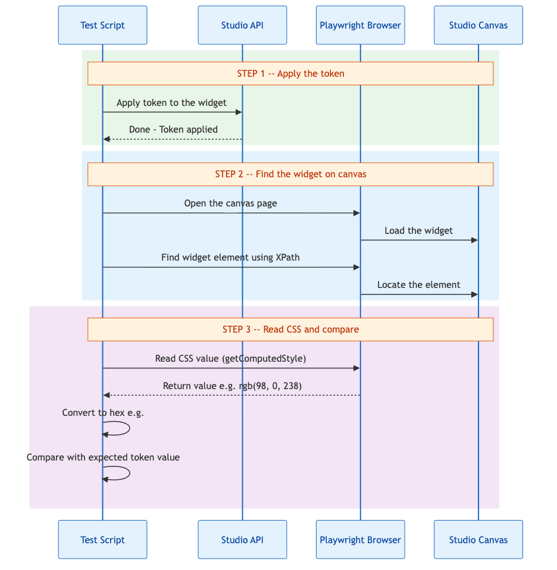
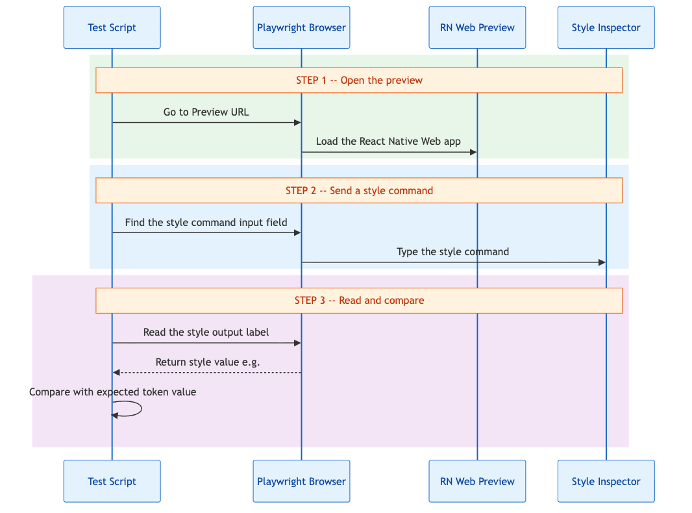
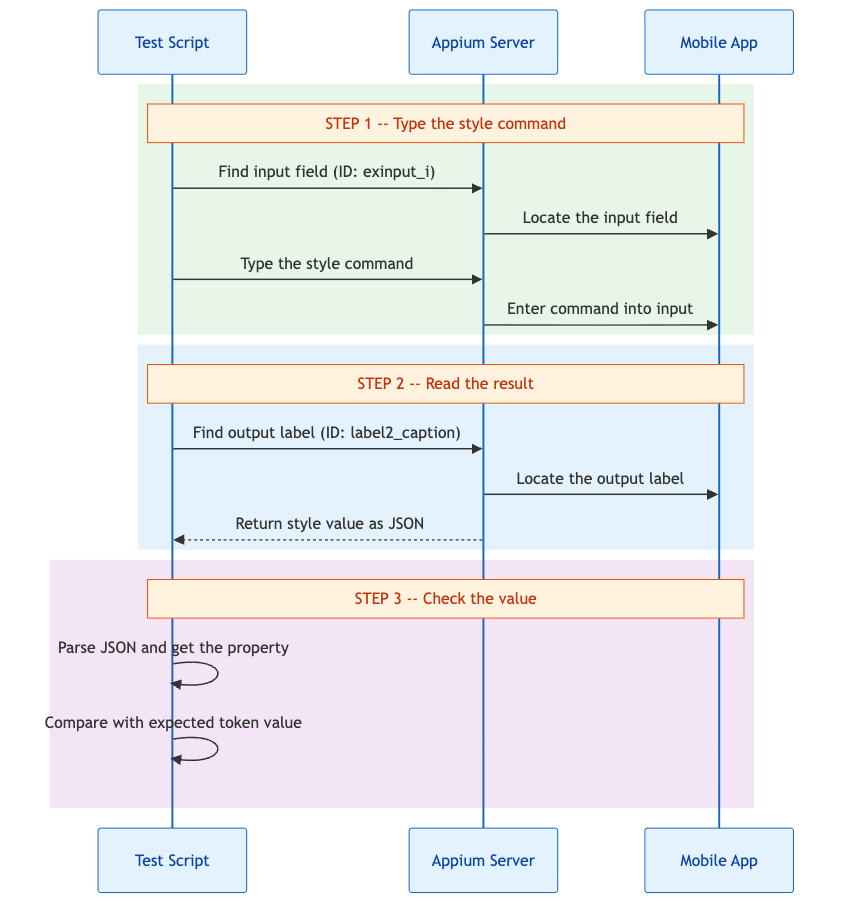
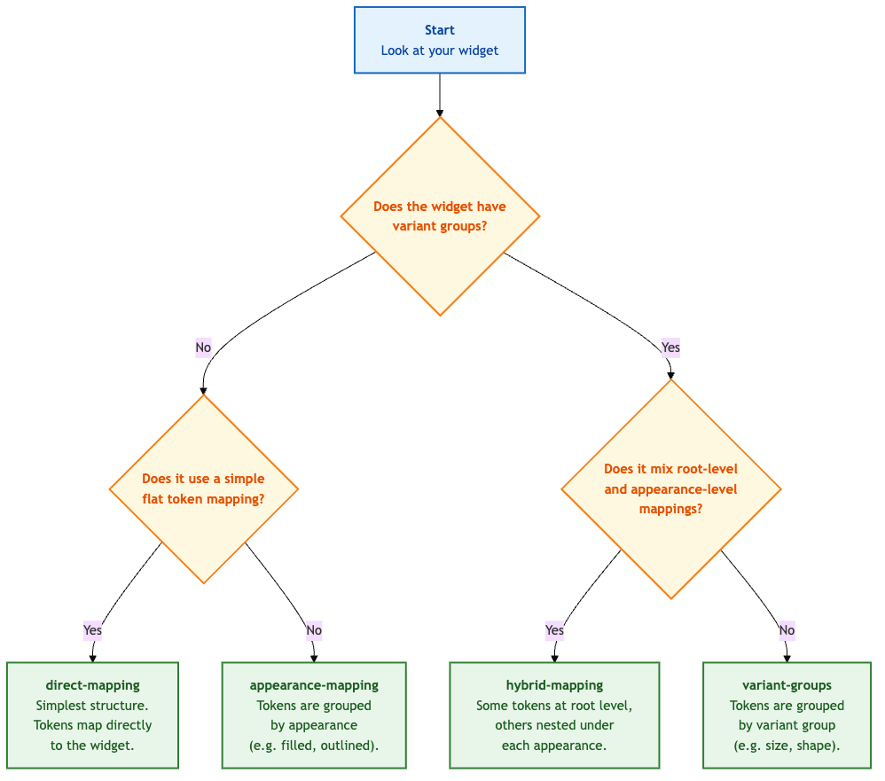

# Architecture Deep Dive

This document provides detailed technical documentation of the framework's core systems: matrix generation, payload creation, CSS verification across all platforms, and visual regression testing.

---

## Table of Contents

1. [Orthogonal Matrix Generation](#1-orthogonal-matrix-generation)
2. [Token Loading and Resolution](#2-token-loading-and-resolution)
3. [Payload Generation](#3-payload-generation)
4. [CSS Verification -- Web Canvas](#4-css-verification--web-canvas)
5. [CSS Verification -- Web Preview](#5-css-verification--web-preview)
6. [CSS Verification -- Mobile (Android and iOS)](#6-css-verification--mobile-android-and-ios)
7. [Visual Regression Testing](#7-visual-regression-testing)
8. [Token Distribution Algorithm](#8-token-distribution-algorithm)
9. [Widget Structure Types](#9-widget-structure-types)

---

## 1. Orthogonal Matrix Generation

### Source Files

- `src/matrix/generator.ts` -- Matrix generation algorithms
- `src/matrix/widgets.ts` -- Widget configuration definitions

### Overview

The matrix generator produces test combinations that cover all pairwise interactions between five dimensions: widget, appearance, variant, state, and token type.

### Full Cartesian Generator

The `generateMatrix()` function produces every valid combination:

```typescript
// src/matrix/generator.ts
function* generateMatrix(): Generator<MatrixItem> {
  for (const widget of Object.keys(WIDGET_CONFIG) as Widget[]) {
    const config = WIDGET_CONFIG[widget];
    for (const appearance of config.appearances) {
      const variants = config.variants[appearance] || [];
      for (const variant of variants) {
        for (const state of config.states) {
          for (const tokenType of TOKEN_TYPES) {
            if (config.allowedTokenTypes.includes(tokenType)) {
              yield { widget, appearance, variant, state, tokenType };
            }
          }
        }
      }
    }
  }
}
```

This produces 25,000+ items. It is useful for understanding total coverage but impractical for execution.

### Orthogonal Matrix Generator

The `generateOrthogonalMatrix()` function uses **modulo-based indexing** to ensure every token type is tested with every combination dimension:

```typescript
// src/matrix/generator.ts (simplified)
function* generateOrthogonalMatrix(options?: { shuffle?: boolean }): Generator<MatrixItem> {
  for (const widget of widgets) {
    const config = WIDGET_CONFIG[widget];
    let combinations = []; // All valid (appearance, variant, state) tuples

    // Collect all valid combinations for this widget
    for (const appearance of config.appearances) {
      const variants = config.variants[appearance] || [];
      for (const variant of variants) {
        for (const state of config.states) {
          combinations.push({ appearance, variant, state });
        }
      }
    }

    // Filter to allowed token types
    let allowedTypes = TOKEN_TYPES.filter(t => config.allowedTokenTypes.includes(t));

    // Optional Fisher-Yates shuffle for randomization
    if (options.shuffle) { /* shuffle combinations and allowedTypes */ }

    // MODULO INDEXING: Map combinations to token types
    const itemsNeeded = Math.max(combinations.length, allowedTypes.length);
    for (let i = 0; i < itemsNeeded; i++) {
      const combo = combinations[i % combinations.length];
      const tokenType = allowedTypes[i % allowedTypes.length];
      yield { widget, ...combo, tokenType };
    }
  }
}
```

### How Modulo Indexing Works

Given a button with 8 combinations and 10 allowed token types:

```
i=0:  combo[0] + tokenType[0]   (filled-primary-default + color)
i=1:  combo[1] + tokenType[1]   (filled-primary-disabled + font)
i=2:  combo[2] + tokenType[2]   (outlined-primary-default + border-width)
...
i=7:  combo[7] + tokenType[7]   (elevated-primary-disabled + elevation)
i=8:  combo[0] + tokenType[8]   (filled-primary-default + opacity)    <-- wraps around
i=9:  combo[1] + tokenType[9]   (filled-primary-disabled + icon)      <-- wraps around
```

The larger array drives the count, and the smaller wraps. This guarantees:

- Every combination is tested with at least one token type
- Every token type is tested with at least one combination
- **Pairwise coverage** is achieved with minimal tests

### Special Case: Full Cartesian for Carousel and Tabbar

Some widgets (carousel, tabbar) have state-dependent properties (e.g., `active` state has different styling). These use full Cartesian instead of orthogonal:

```typescript
if (widget === 'carousel' || widget === 'tabbar') {
  for (const combo of combinations) {
    for (const tokenType of allowedTypes) {
      yield { widget, ...combo, tokenType };
    }
  }
  continue;
}
```

### Reduction Math Example

For the `button` widget:

```
Appearances: 4 (filled, outlined, text, elevated)
Variants per appearance: 1 (primary)
States: 2 (default, disabled)
Combinations: 4 x 1 x 2 = 8

Allowed token types: 10 (color, font, border-radius, border-style, 
                         border-width, elevation, gap, icon, space, opacity)

Full Cartesian: 8 x 10 = 80 tests
Orthogonal:     max(8, 10) = 10 tests
Reduction:      87.5%
```

---

## 2. Token Loading and Resolution

### Source Files

- `src/tokens/loader.ts` -- Reads token JSON files from disk
- `src/tokens/mappingService.ts` -- Maps token references to CSS properties and values
- `src/tokens/schema.ts` -- Zod schemas for token file validation
- `tokens/mobile/global/` -- Source token JSON files
- `tokens/token-values-mobile.json` -- Generated token value lookup map

### Token File Structure

Token files are JSON files organized by category. Example (`tokens/mobile/global/color.json`):

```json
{
  "color": {
    "background": {
      "btn": {
        "primary": {
          "default": {
            "value": "#6200EE",
            "type": "color",
            "description": "Primary button background"
          }
        }
      }
    }
  }
}
```

### Token Value Map Generation

The `build:token-map` script (`scripts/generate-token-values.ts`) scans all global token files and produces a flat lookup map:

```json
{
  "{color.background.btn.primary.default.value}": "#6200EE",
  "{font.body.fontSize.value}": "16",
  "{border-radius.md.value}": "8"
}
```

This map is used at test time to resolve token references to actual CSS values.

### Token Mapping Service

The `TokenMappingService` (`src/tokens/mappingService.ts`) is responsible for:

1. **Type Inference** (`inferPropertyPath()`): Determines the CSS property from a token reference using keyword matching

   ```
   Token: {color.background.btn.primary.default.value}
   Inferred: type=color, property=background-color
   ```

2. **Value Normalization** (`normalizeValue()`): Ensures consistent comparison across platforms

   ```
   rgb(98, 0, 238)  -->  #6200ee     (RGB to hex)
   "16px"           -->  "16"         (strip units)
   "bold"           -->  "700"        (font-weight keywords)
   "transparent"    -->  "rgba(0,0,0,0)"
   ```

3. **Computed Property Mapping** (`mapToComputedProperty()`): Converts logical properties to JavaScript computed style names

   ```
   background-color  -->  backgroundColor
   border-radius     -->  borderRadius
   font-size         -->  fontSize
   ```

---

## 3. Payload Generation

### Source Files

- `src/matrix/generator.ts` -- `generateVariantPayload()` function
- `src/playwright/tokenSlotGenerator.ts` -- Slot-based test case generator
- `wdio/config/widget-token-slots.json` -- Token slot definitions (source of truth)

### Token Slot Definitions

The `widget-token-slots.json` file defines which properties each widget supports using a flat `tokenSlots` array per widget. Each entry specifies a token type and its applicable CSS properties:

```json
{
  "button": {
    "tokenSlots": [
      { "tokenType": "color", "properties": ["background", "color", "border.color"] },
      { "tokenType": "font", "properties": ["font-size", "font-weight", "line-height", "letter-spacing", "font-family"] },
      { "tokenType": "icon", "properties": ["icon-size"] },
      { "tokenType": "border-radius", "properties": ["radius"] },
      { "tokenType": "border-width", "properties": ["border.width"] },
      { "tokenType": "border-style", "properties": ["border.style"] },
      { "tokenType": "elevation", "properties": ["shadow"] },
      { "tokenType": "opacity", "properties": ["opacity"] },
      { "tokenType": "gap", "properties": ["gap"] },
      { "tokenType": "space", "properties": ["padding.top", "padding.bottom", "padding.left", "padding.right", "height", "min-width"] }
    ]
  }
}
```

### Slot-Based Test Case Generation

The `tokenSlotGenerator.ts` generates test cases that achieve 100% slot coverage by iterating over each widget's `tokenSlots` array and combining them with the widget's matrix items (appearance/variant/state):

```typescript
// For each widget -> tokenSlot -> property, combined with matrix items
function generateTestCasesForWidget(widget: string, config: object): TestCase[] {
  const testCases = [];
  const matrixItems = generateOrthogonalMatrix(); // widget's appearance-variant-state combos

  for (const slot of config.tokenSlots) {
    for (const property of slot.properties) {
      for (const matrixItem of matrixItems) {
        const token = findCompatibleToken(slot.tokenType, property);
        testCases.push({
          widget,
          appearance: matrixItem.appearance,
          variant: matrixItem.variant,
          state: matrixItem.state,
          tokenType: slot.tokenType,
          property,
          tokenRef: token.ref,
          expectedValue: token.value
        });
      }
    }
  }
  return testCases;
}
```

### Token Selection Strategy

The `findCompatibleToken()` function uses **hash-based selection** to ensure:

- Different variants get different tokens (avoiding false positives)
- Token type matches the slot's expected type
- Selection is deterministic (same inputs produce same token)

```typescript
function findCompatibleToken(tokenType, property, variant): Token {
  const compatibleTokens = globalTokens.filter(t => t.type === tokenType);
  const hash = hashString(`${variant}-${property}`);
  return compatibleTokens[hash % compatibleTokens.length];
}
```

### Payload Structure Types

The `generateVariantPayload()` function builds the correct JSON structure based on the widget type. There are four structures:

#### Type 1: `direct-mapping`

Used by: accordion, anchor, webview, and other simple widgets

```json
{
  "accordion": {
    "mapping": {
      "header": {
        "background-color": "{color.surface.accordion.value}"
      }
    }
  }
}
```

#### Type 2: `hybrid-mapping`

Used by: navbar

Supports both root-level and appearance-specific mappings:

```json
{
  "navbar": {
    "mapping": {
      "background-color": "{color.background.navbar.value}"
    },
    "appearances": {
      "standard": {
        "mapping": {
          "title": {
            "font-size": "{font.heading.fontSize.value}"
          }
        }
      }
    }
  }
}
```

#### Type 3: `appearance-mapping`

Used by: cards

```json
{
  "card": {
    "appearances": {
      "default": {
        "mapping": {
          "title": {
            "font-size": "{font.heading.fontSize.value}"
          }
        }
      }
    }
  }
}
```

#### Type 4: `variant-groups` (Default)

Used by: button, panel, label, and most other widgets

```json
{
  "btn": {
    "appearances": {
      "filled": {
        "variantGroups": {
          "status": {
            "primary": {
              "stateStyles": {
                "default": {
                  "background": "{color.background.btn.primary.default.value}"
                }
              }
            }
          }
        }
      }
    }
  }
}
```

### Batch Payload Merging (Mobile)

For mobile testing, all individual payloads are **deep-merged** into a single batch payload per widget:

```typescript
// Mobile global setup merges all token-variant pairs into one payload
const batchPayload = {};
for (const testCase of allTestCases) {
  const individualPayload = generateVariantPayload(testCase.item, testCase.property, testCase.tokenRef);
  deepMerge(batchPayload, individualPayload);
}
// Saved to .test-cache/batch-payload-{widget}.json
```

This batch payload is applied once via the Studio API before building the mobile app.

---

## 4. CSS Verification -- Web Canvas

### Source Files

- `tests/token_slot_validation.spec.ts` -- Main validation logic
- `src/matrix/widget-xpaths.ts` -- XPath selectors (332 entries across 35+ widgets)
- `src/tokens/mappingService.ts` -- Value normalization

### How Canvas CSS Extraction Works

Canvas validation uses Playwright's `page.$eval()` to extract computed CSS values from the Studio's design canvas:



### XPath Resolution

XPaths follow the pattern `{widget}-{appearance}-{variant}-{state}`:

```typescript
// src/matrix/widget-xpaths.ts
export const widgetXPaths = {
  canvas: {
    'button-filled-primary-default': '//div[contains(@class, "btn-filled")]//button[contains(@class, "primary")]',
    'button-filled-primary-disabled': '//div[contains(@class, "btn-filled")]//button[@disabled]',
    'accordion-standard-standard-default': '//div[contains(@class, "panel-group")]',
    // ... 332 entries
  }
};
```

### Property-Specific Element Selection

Some CSS properties apply to sub-elements (e.g., a button's text `color` is on an inner `span`, not the outer `button`). The `getElementSuffixFromPropertyPath()` function maps property paths to element suffixes:

```typescript
// Maps property paths to the correct sub-element
// "header.background-color" → look for the header sub-element
// "title.font-size" → look for the title sub-element
// "border.color" → look at the root element border

const elementSuffix = getElementSuffixFromPropertyPath(propertyPath);
const fullXPath = baseXPath + (elementSuffix ? `-${elementSuffix}` : '');
```

### CSS Value Extraction

```typescript
// Actual CSS extraction in test
const actualValue = await page.$eval(
  xpath,
  (el, prop) => window.getComputedStyle(el).getPropertyValue(prop),
  cssProperty  // e.g., 'background-color'
);
```

### Value Normalization

Before comparison, both expected and actual values are normalized:

```typescript
// src/tokens/mappingService.ts
static normalizeValue(value: string): string {
  // RGB to hex: rgb(98, 0, 238) → #6200ee
  // Strip units: "16px" → "16"
  // Font-weight keywords: "bold" → "700", "normal" → "400"
  // Transparent: "transparent" → "rgba(0,0,0,0)"
  // Trim whitespace and lowercase
}
```

---

## 5. CSS Verification -- Web Preview

### Source Files

- `tests/token_slot_validation.spec.ts` (Preview section, lines ~636-704)
- `wdio/utils/mobileMapper.ts` -- RN style path mapping
- `src/matrix/widget-xpaths.ts` -- Preview inspector selectors

### How Preview Verification Works

The Web Preview runs a React Native Web build. Instead of `getComputedStyle()`, the framework uses **React Native style commands** injected through a style inspector:



### React Native Style Commands

The command format accesses the widget's internal React Native style tree:

```
App.appConfig.currentPage.Widgets.{studioWidgetName}._INSTANCE.styles.{rnStylePath}
```

Example commands:

```
# Get button background color
App.appConfig.currentPage.Widgets.button1._INSTANCE.styles.root.backgroundColor

# Get label font size
App.appConfig.currentPage.Widgets.label1._INSTANCE.styles.text.fontSize

# Get accordion header color
App.appConfig.currentPage.Widgets.accordion1._INSTANCE.styles.header.backgroundColor
```

### MobileMapper: CSS to RN Style Path Conversion

The `MobileMapper` class (`wdio/utils/mobileMapper.ts`) converts logical CSS property paths to React Native style paths:

```
CSS: background-color → RN: root.backgroundColor
CSS: font-size → RN: text.fontSize
CSS: border-radius → RN: root.borderRadius
CSS: padding → RN: root.paddingTop (or specific direction)
```

Each widget has specific mappings because the RN component tree differs from the CSS DOM tree.

### Inspector Element Selectors

```typescript
// src/matrix/widget-xpaths.ts
export const widgetXPaths = {
  previewInspector: {
    styleCommandInput: '//input[@data-testid="style-command-input"]',
    styleOutputLabel: '//label[@data-testid="style-output-label"]'
  }
};
```

---

## 6. CSS Verification -- Mobile (Android and iOS)

### Source Files

- `wdio/helpers/mobileVerification.helper.ts` -- Verification logic
- `wdio/pages/MobileWidget.page.ts` -- Page Object Model
- `wdio/utils/mobileMapper.ts` -- Style path mapping
- `wdio/utils/mobileTestData.ts` -- Test data loader

### How Mobile Verification Works

Mobile tests use the same RN style command approach as Preview, but executed through Appium accessibility IDs instead of Playwright:



### Accessibility ID Elements

The mobile app includes a debugging interface with two elements:

- `~exinput_i` -- Text input field for entering RN style commands
- `~label2_caption` -- Label that displays the command result (JSON)

### Style Extraction Flow

```typescript
// wdio/pages/MobileWidget.page.ts (simplified)
class MobileWidgetPage {
  async getStyleValue(widgetName: string, rnPath: string): Promise<string> {
    const command = `App.appConfig.currentPage.Widgets.${widgetName}._INSTANCE.styles.${rnPath}`;

    // Enter command into input field
    const input = await $('~exinput_i');
    await input.setValue(command);

    // Read result from output label
    const output = await $('~label2_caption');
    const result = await output.getText();

    return JSON.parse(result);
  }
}
```

### Platform-Specific Selectors

While the RN style commands are identical across platforms, the Appium selectors differ:

```typescript
// Android: UiAutomator2
const element = await $('android=new UiSelector().resourceId("exinput_i")');

// iOS: XCUITest
const element = await $('~exinput_i'); // Accessibility ID
```

### Widget Name Mapping (CSV Files)

Mobile tests use CSV files to map matrix variant names to Studio widget instance names:

```csv
# tests/testdata/mobile/button-widget-variants.csv
variantName,studioWidgetName
button-filled-primary-default,button1
button-filled-primary-disabled,button2
button-outlined-primary-default,button3
button-outlined-primary-disabled,button4
button-text-primary-default,button5
```

These CSV files are loaded by `wdio/utils/mobileTestData.ts` at test runtime.

---

## 7. Visual Regression Testing

### Web Visual Regression (Playwright)

**Configuration** (`playwright.config.ts`):

```typescript
expect: {
  toHaveScreenshot: {
    maxDiffPixels: 100,        // Allow up to 100 pixels difference
    maxDiffPixelRatio: 0.01,   // Allow up to 1% pixel difference
    threshold: 0.2,            // Per-pixel color threshold (0-1)
    animations: 'disabled',    // Disable animations for consistency
  }
}
```

**Directories**:

- Baselines: `screenshots/base-image/`
- Actuals: `screenshots/actual-image/` (generated during tests)
- Diffs: `screenshots/difference-image/` (generated on failure)

**Usage in tests**:

```typescript
await expect(page).toHaveScreenshot('button-filled-primary-default.png');
```

### Mobile Visual Regression (pixelmatch)

**Source File**: `wdio/helpers/screenshot.helpers.ts`

Mobile visual regression uses a custom implementation with the `pixelmatch` library:

```typescript
import pixelmatch from 'pixelmatch';
import { PNG } from 'pngjs';

function compareScreenshots(baselinePath: string, actualPath: string): ComparisonResult {
  const baseline = PNG.sync.read(fs.readFileSync(baselinePath));
  const actual = PNG.sync.read(fs.readFileSync(actualPath));
  const diff = new PNG({ width: baseline.width, height: baseline.height });

  const diffPixels = pixelmatch(
    baseline.data, actual.data, diff.data,
    baseline.width, baseline.height,
    { threshold: 0.03 }  // 3% color difference threshold
  );

  const totalPixels = baseline.width * baseline.height;
  const diffPercentage = diffPixels / totalPixels;

  return {
    match: diffPercentage >= 0.03,  // INVERTED: PASS if visual change detected
    diffPixels,
    diffPercentage,
    diffImagePath: saveDiffImage(diff)
  };
}
```

**Important: Inverted Logic**

Mobile screenshot comparison uses **inverted logic** compared to typical visual regression:

- Standard visual regression: **PASS** if images are identical
- This framework: **PASS** if images are **different** (meaning the token visually changed the widget)

This makes sense because the test is verifying that applying a token **actually changes** the widget's appearance.

**Directories**:

- Baselines: `screenshots/mobile-base/{platform}/` (from baseline app)
- Actuals: `screenshots/mobile-actual/{platform}/` (from actual app)
- Diffs: `screenshots/mobile-diff/{platform}/` (generated during comparison)

---

## 8. Token Distribution Algorithm

### Source Files

- `src/matrix/generator.ts` -- `distributeTokensToWidgets()` and `generateTokenVariantMapping()`

### How Tokens Are Distributed

The framework selects tokens from the global token pool and distributes them to widgets:

1. **Token Selection** (during global setup):
   - Scans `tokens/mobile/global/` directory
   - Picks 1-2 random tokens per file
   - Infers token type using `TokenMappingService.getMetadata()`
   - Saves selected tokens to `.test-cache/selected-tokens.json`

2. **Token-Variant Pairing** (`generateTokenVariantMapping()`):
   - Pairs selected tokens with matrix items
   - Filters by widget's `allowedTokenTypes`
   - Creates exhaustive mappings ensuring all tokens are used

3. **Round-Robin Distribution** (`distributeTokensToWidgets()`):
   - Distributes tokens evenly across widgets
   - Each widget gets at least one token per allowed type
   - Hash-based slot selection ensures variety

### Property Path Computation

The `computeFinalPropertyPath()` function determines which CSS property a token will modify:

```typescript
function computeFinalPropertyPath(item: MatrixItem, propertyPath: string[], tokenRef: string): string {
  // Special token type overrides
  if (item.tokenType === 'asterisk-color') return 'asterisk.color';
  if (item.tokenType === 'margin') return 'margin';
  if (['padding', 'space', 'spacer'].includes(item.tokenType)) return 'padding';

  // Check if token's property path matches a valid slot
  const slots = getPropertyPathsForType(item.widget, item.tokenType);
  const flatSlots = slots.map(s => s.join('.'));

  if (flatSlots.includes(propertyPath.join('.'))) {
    return propertyPath.join('.');  // Exact match
  } else {
    // Round-robin based on token hash
    const hash = tokenRef.split('').reduce((acc, c) => acc + c.charCodeAt(0), 0);
    return flatSlots[hash % flatSlots.length];
  }
}
```

---

## 9. Widget Structure Types

### Source Files

- `src/matrix/widgets.ts` -- `WIDGET_STRUCTURE_MAP`

### Structure Type Map

Each widget is assigned a structure type that determines how its payload is formatted:

```typescript
export const WIDGET_STRUCTURE_MAP: Record<Widget, StructureType> = {
  // direct-mapping: Simple flat mapping
  accordion: 'direct-mapping',
  anchor: 'direct-mapping',
  webview: 'direct-mapping',
  bottomsheet: 'direct-mapping',
  barcodescanner: 'direct-mapping',

  // hybrid-mapping: Root + appearance-specific
  navbar: 'hybrid-mapping',

  // appearance-mapping: Per-appearance mapping
  cards: 'appearance-mapping',
  formcontrols: 'appearance-mapping',

  // variant-groups: Full variant group nesting (default for most widgets)
  button: 'variant-groups',
  label: 'variant-groups',
  panel: 'variant-groups',
  picture: 'variant-groups',
  // ... and most other widgets
};
```

### Decision Tree for Structure Type



### Widget Key Shortening

Some widgets use shortened keys in payloads:

```typescript
const keyMap = {
  button: 'btn',
  cards: 'card',
  formcontrols: 'form-controls',
  'form-wrapper': 'form',
  radioset: 'radiobutton',
  'dropdown-menu': 'dropdown'
};
```

---

## Next Steps

- [Adding New Widgets](04-ADDING-NEW-WIDGETS.md) -- How to integrate a new widget using these systems
- [Web Testing Guide](05-WEB-TESTING-GUIDE.md) -- Running and understanding Playwright tests
- [Mobile Testing Guide](06-MOBILE-TESTING-GUIDE.md) -- Running and understanding WebDriverIO tests
