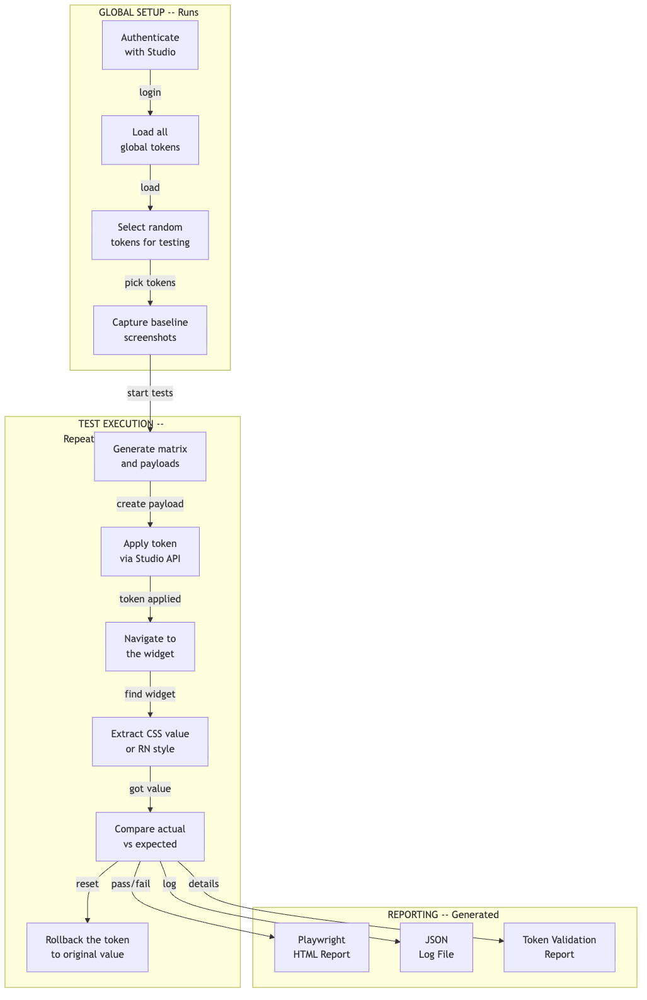
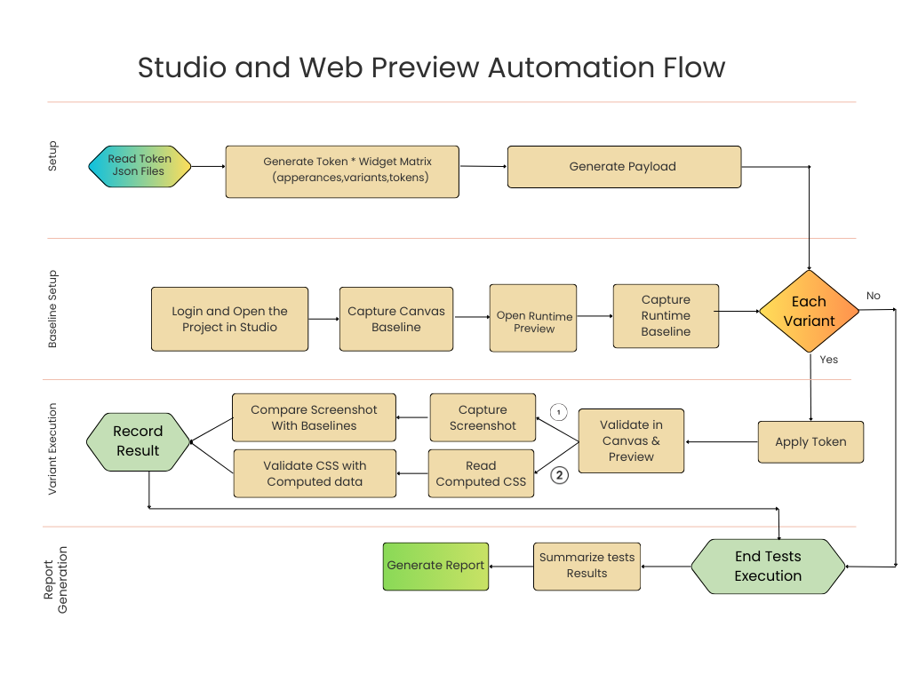

# Web Testing Guide (Playwright)

This guide covers everything you need to know about running, understanding, and debugging web tests using Playwright. Web tests validate token rendering on two targets: **Canvas** (Studio design time) and **Preview** (React Native Web runtime).

---

## Table of Contents

1. [Test Architecture](#test-architecture)
2. [Global Setup](#global-setup)
3. [Canvas Testing](#canvas-testing)
4. [Preview Testing](#preview-testing)
5. [Slot Validation Testing](#slot-validation-testing)
6. [Running Tests](#running-tests)
7. [Filtering Tests](#filtering-tests)
8. [Understanding Test Reports](#understanding-test-reports)
9. [Debugging Failed Tests](#debugging-failed-tests)
10. [Configuration](#configuration)

---

## Test Architecture



### Detailed Studio & Web Preview Automation Flow



---

## Global Setup

**File**: `tests/global-setup.ts`

The global setup runs once before all test workers. It performs:

### 1. Authentication

```typescript
// Authenticates with WaveMaker Studio
// Captures auth_cookie and JSESSIONID
// Saves state to .test-cache/auth.json for use by all tests
```

Authentication state is stored in `.test-cache/auth.json` and loaded by Playwright via the `storageState` config:

```typescript
// playwright.config.ts
use: {
  storageState: '.test-cache/auth.json',
}
```

### 2. Token Loading and Selection

```typescript
// Loads all tokens from tokens/mobile/global/
// Selects 1-2 random tokens per file
// Infers token type via TokenMappingService
// Saves to .test-cache/selected-tokens.json
```

### 3. Baseline Screenshot Capture

Before applying any tokens, the setup captures baseline screenshots of all widgets in their default state. These are used for visual regression comparison.

---

## Canvas Testing

Canvas tests validate that tokens are correctly applied in WaveMaker Studio's design-time canvas view.

### How It Works

1. **Apply Token**: Send a token payload to the Studio API
2. **Publish**: Trigger a publish to update the canvas
3. **Navigate**: Open the canvas page with the widget
4. **Extract CSS**: Use `getComputedStyle()` to read the rendered CSS value
5. **Compare**: Check that the computed CSS matches the expected token value

### CSS Extraction

```typescript
// Extract a CSS property value from a widget element
const actualValue = await page.$eval(
  xpathSelector,
  (element, property) => {
    const style = window.getComputedStyle(element);
    return style.getPropertyValue(property);
  },
  cssPropertyName  // e.g., 'background-color', 'font-size'
);
```

### XPath Selector Resolution

Each widget variant has a unique XPath defined in `src/matrix/widget-xpaths.ts`:

```
Key format: {widget}-{appearance}-{variant}-{state}
Example:    button-filled-primary-default
Value:      //div[contains(@class, "btn-filled")]//button[contains(@class, "primary")]
```

For properties that apply to sub-elements (e.g., title font-size inside a card), a suffix is appended:

```
Base XPath:  card-default-standard-default
Property:    title.fontSize
Full XPath:  card-default-standard-default-title
```

### Canvas Page URL

```
{STUDIO_BASE_URL}/{CANVAS_PATH}
Default: https://stage-studio.wavemakeronline.com/s/page/Main?project-id={PROJECT_ID}
```

---

## Preview Testing

Preview tests validate tokens in the React Native Web runtime environment.

### How It Works

1. **Apply Token**: Same as canvas (Studio API)
2. **Deploy**: Trigger an in-place deploy for the preview
3. **Navigate**: Open the preview URL
4. **Enter RN Command**: Type a style command into the inspector input
5. **Read Result**: Read the style value from the inspector output
6. **Compare**: Check the value matches the expected token

### Style Inspector Interface

The preview includes a debugging interface:

```
Input:  //input[@data-testid="style-command-input"]
Output: //label[@data-testid="style-output-label"]
```

### RN Style Commands

```
# Format
App.appConfig.currentPage.Widgets.{widgetName}._INSTANCE.styles.{rnPath}

# Examples
App.appConfig.currentPage.Widgets.button1._INSTANCE.styles.root.backgroundColor
App.appConfig.currentPage.Widgets.label1._INSTANCE.styles.text.fontSize
App.appConfig.currentPage.Widgets.accordion1._INSTANCE.styles.header.backgroundColor
```

### Preview URL

```
{STUDIO_BASE_URL}{PREVIEW_PATH}
Default: https://stage-studio.wavemakeronline.com/preview
```

---

## Slot Validation Testing

**File**: `tests/token_slot_validation.spec.ts`

Slot validation is the most comprehensive test mode. It validates every defined token slot for every widget variant.

### How It Differs from Matrix Tests

| Aspect | Matrix Tests | Slot Validation |
|--------|-------------|-----------------|
| Coverage | Orthogonal (pairwise) | 100% slot coverage |
| Source of truth | `WIDGET_CONFIG` | `widget-token-slots.json` |
| Token selection | Random from pool | Hash-based per slot |
| Payload strategy | One token at a time | One token at a time |

### Test Flow

For each widget in `widget-token-slots.json`:

```
For each appearance:
  For each variant:
    For each state:
      For each token type:
        For each property slot:
          1. Find a compatible token
          2. Generate payload
          3. Apply via Studio API
          4. Validate on canvas and/or preview
```

### Slot Verification Targets

The `SLOT_VERIFY_TARGET` environment variable controls which targets are validated:

- `canvas` -- Validate on Studio Canvas only
- `preview` -- Validate on RN Web Preview only
- `both` (default) -- Validate on both targets

---

## Running Tests

### All Web Tests

```bash
npm test                    # Run all Playwright tests
npm run test:headed         # Run with visible browser (for debugging)
```

### Slot Validation

```bash
npm run test:slots          # Both canvas and preview
npm run test:slots:canvas   # Canvas only
npm run test:slots:preview  # Preview only (headed)
npm run test:slots:headed   # Both targets, visible browser
```

### Target-Specific

```bash
npm run test:canvas         # Canvas validation only
npm run test:preview        # Preview validation only
```

### Visual Regression

```bash
npm run test:update         # Update baseline screenshots
```

---

## Filtering Tests

### By Widget

Use the `TEST_WIDGETS` environment variable to test specific widgets:

```bash
# Single widget
TEST_WIDGETS=button npm run test:slots

# Multiple widgets (comma-separated)
TEST_WIDGETS=button,accordion,label npm run test:slots

# Combined with target filter
TEST_WIDGETS=button SLOT_VERIFY_TARGET=canvas npm run test:slots
```

### By Spec File

Run a specific test file using Playwright's `--grep` option:

```bash
npx playwright test tests/token_slot_validation.spec.ts
npx playwright test tests/token_apply_and_validate.spec.ts
```

---

## Understanding Test Reports

### Playwright HTML Report

After running tests, view the interactive HTML report:

```bash
npx playwright show-report
# or
npm run report
```

The report shows:

- Pass/fail status for each test
- Screenshots for failed tests (baseline, actual, diff)
- Trace files for step-by-step debugging
- Duration and retry information

### JSON Log

Detailed test execution logs are saved to `logs/playwright-log.json`. This includes:

- Token reference and expected value for each test
- Actual CSS value extracted
- Whether normalization was applied
- Error messages for failures

### Token Validation Report

The `tokenTestReporter.ts` generates a structured report showing:

- Total tokens tested per widget
- Pass/fail counts
- Property coverage per widget variant
- Missing or misconfigured slots

Reports are saved to `artifacts/playwright-token-reports/`.

---

## Debugging Failed Tests

### 1. View the Trace

Playwright captures traces for every test. Open them in the Trace Viewer:

```bash
npx playwright show-trace artifacts/test-results/{test-name}/trace.zip
```

The Trace Viewer shows:

- Every action (click, navigate, evaluate) with timestamps
- Screenshots at each step
- Network requests
- Console logs

### 2. Run in Headed Mode

See the browser during execution:

```bash
npm run test:headed
# or
npx playwright test --headed --debug
```

### 3. Common Failure Patterns

| Symptom | Likely Cause | Fix |
|---------|-------------|-----|
| Authentication failure | Expired credentials | Update STUDIO_USERNAME/STUDIO_PASSWORD in `.env` |
| Element not found | Incorrect XPath | Verify XPath in Chrome DevTools |
| Value mismatch | Normalization issue | Check `TokenMappingService.normalizeValue()` |
| Timeout | Slow deploy/publish | Increase timeout in `playwright.config.ts` |
| Screenshot mismatch | Animation/timing | Set `animations: 'disabled'` (already configured) |
| Studio API 401 | Session expired | Framework auto-retries, but check cookies |

### 4. Inspect Cached Data

Check `.test-cache/` for intermediate data:

```bash
# Authentication state
cat .test-cache/auth.json

# Selected tokens
cat .test-cache/selected-tokens.json

# Generated payloads per widget
ls .test-cache/payloads/
cat .test-cache/payloads/button.json
```

### 5. Run a Single Widget in Debug Mode

```bash
TEST_WIDGETS=button npx playwright test tests/token_slot_validation.spec.ts --headed --debug
```

---

## Configuration

### Playwright Config (`playwright.config.ts`)

Key settings:

```typescript
{
  testDir: './tests',
  fullyParallel: true,
  retries: process.env.CI ? 4 : 0,        // Retry on CI
  workers: 1,                               // Sequential execution
  timeout: 120000,                          // 2 minutes per test

  use: {
    headless: true,
    viewport: { width: 1280, height: 720 },
    trace: 'on',
    screenshot: 'on',
    video: 'on',
    storageState: '.test-cache/auth.json',
  },

  expect: {
    toHaveScreenshot: {
      maxDiffPixels: 100,
      maxDiffPixelRatio: 0.01,
      threshold: 0.2,
      animations: 'disabled',
    }
  },

  snapshotPathTemplate: 'screenshots/base-image/{arg}{ext}',
  outputDir: 'artifacts/test-results',
}
```

### Adjustable Settings

| Setting | Default | Purpose |
|---------|---------|---------|
| `workers` | 1 | Number of parallel workers |
| `timeout` | 120000 | Test timeout in ms |
| `retries` | 0 (local), 4 (CI) | Auto-retry count |
| `maxDiffPixels` | 100 | Allowed pixel difference |
| `threshold` | 0.2 | Per-pixel color threshold |

---

## Next Steps

- [Mobile Testing Guide](06-MOBILE-TESTING-GUIDE.md) -- For Android and iOS testing
- [Architecture Deep Dive](03-ARCHITECTURE-DEEP-DIVE.md) -- Understanding CSS verification internals
- [Troubleshooting and FAQ](08-TROUBLESHOOTING-AND-FAQ.md) -- Common issues and solutions
