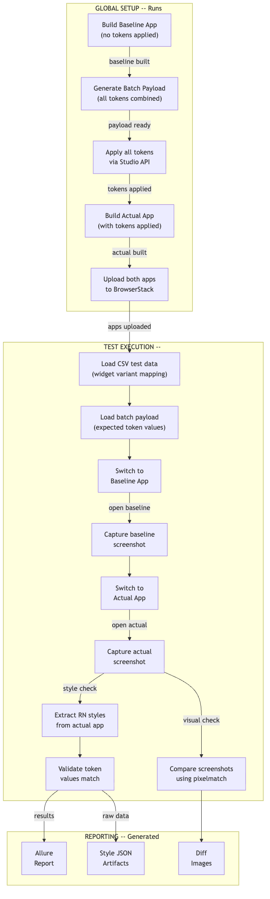
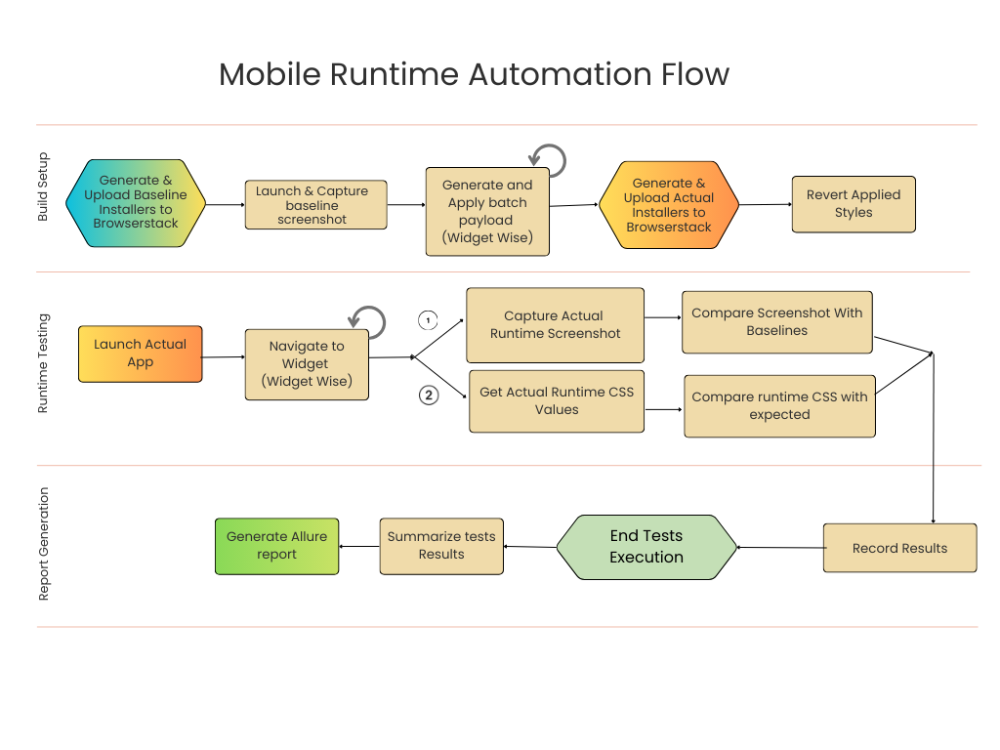
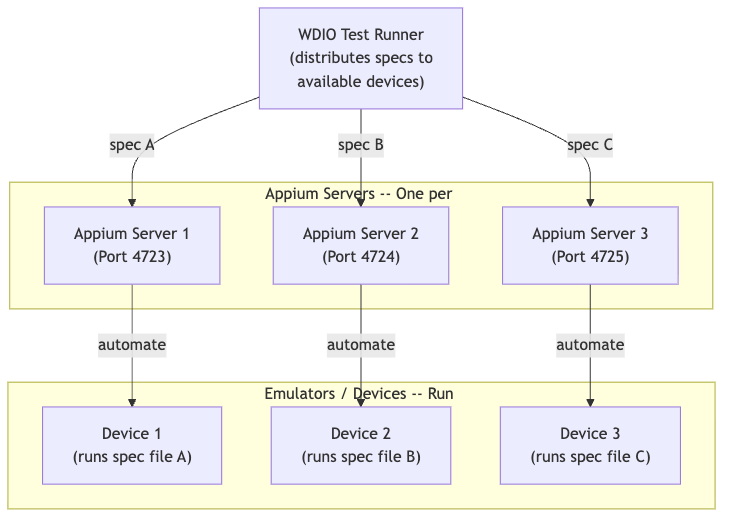

# Mobile Testing Guide (WebDriverIO / Appium)

This guide covers everything you need to know about running, understanding, and debugging mobile tests. Mobile tests use WebDriverIO with Appium to validate token rendering on **Android** and **iOS** native apps built with React Native.

---

## Table of Contents

1. [Mobile Test Architecture](#mobile-test-architecture)
2. [The Two-App Strategy](#the-two-app-strategy)
3. [Global Setup Process](#global-setup-process)
4. [BrowserStack Cloud Execution](#browserstack-cloud-execution)
5. [Local Appium Execution](#local-appium-execution)
6. [Parallel Execution](#parallel-execution)
7. [Running Tests](#running-tests)
8. [Screenshot Comparison](#screenshot-comparison)
9. [Style Verification](#style-verification)
10. [Allure Reporting](#allure-reporting)
11. [Debugging Mobile Tests](#debugging-mobile-tests)
12. [Configuration Files](#configuration-files)

---

## Mobile Test Architecture



### Detailed Mobile Runtime Automation Flow



---

## The Two-App Strategy

Instead of building a separate app for each token change, the framework builds exactly **two apps**:

### Baseline App

- Built with **default tokens** (no customizations)
- Represents the "before" state
- Used as the reference for visual comparison

### Actual App

- Built with **all tokens applied** (batch payload)
- Represents the "after" state
- Contains every token for every widget variant in a single build

### Why This Works

```
Traditional approach:
  Token 1 → Build App → Test → Token 2 → Build App → Test → ...
  N tokens × 5 min build = hours

Batch approach:
  Build Baseline (5 min) + Apply All Tokens + Build Actual (5 min) = 10 min total
  Speedup: 5-10x faster
```

---

## Global Setup Process

**File**: `wdio/specs/mobile.global.setup.ts`

The global setup is run explicitly before test execution:

```bash
npm run test:mobile:setup
```

### Phase 1: Build Baseline App

```
1. Login to WaveMaker Studio
2. Export the project (default state, no custom tokens)
3. Build the React Native app:
   - Android: Generate APK via Gradle
   - iOS: Generate IPA via Xcode
4. Save app to mobile-builds/baseline/
```

### Phase 2: Generate Batch Payload

```
1. Load widget-token-slots.json (source of truth)
2. Load global tokens from tokens/mobile/global/
3. For each widget → appearance → variant → state → token type → property:
   - Find a compatible token
   - Generate individual payload
   - Deep merge into the widget's batch payload
4. Save payloads to .test-cache/batch-payload-{widget}.json
```

### Phase 3: Apply and Build Actual App

```
1. Apply each widget's batch payload via Studio API
2. Publish and build the project
3. Export the project (with all tokens applied)
4. Build the React Native app
5. Save app to mobile-builds/actual/
```

### Phase 4: Upload to BrowserStack (If Cloud Testing)

```
1. Upload baseline APK/IPA to BrowserStack
2. Upload actual APK/IPA to BrowserStack
3. Save app URLs to .test-cache/browserstack-app-urls.json
```

---

## BrowserStack Cloud Execution

### Configuration

**File**: `wdio/config/wdio.browserstack.conf.ts`

BrowserStack execution requires:

```bash
# .env
BROWSERSTACK_USERNAME=your_username
BROWSERSTACK_ACCESS_KEY=your_access_key
BROWSERSTACK_ANDROID_DEVICE=Google Pixel 8 Pro
BROWSERSTACK_ANDROID_OS=14.0
BROWSERSTACK_IOS_DEVICE=iPhone 14
BROWSERSTACK_IOS_OS=16
BROWSERSTACK_MAX_INSTANCES=5
```

### How App URLs Are Resolved

After upload, the WDIO config dynamically reads app URLs:

```typescript
// wdio.browserstack.conf.ts
const appUrl = fs.readFileSync('.test-cache/browserstack-android-app-url.txt', 'utf8');
// or from environment: process.env.BROWSERSTACK_ANDROID_APP_URL
```

### Running on BrowserStack

```bash
# Android only
npm run test:mobile

# iOS only
npm run test:mobile:ios

# Both platforms (full suite)
npm run test:mobile:full
```

### Capabilities

```typescript
capabilities: [{
  platformName: 'Android',
  'appium:deviceName': process.env.BROWSERSTACK_ANDROID_DEVICE,
  'appium:platformVersion': process.env.BROWSERSTACK_ANDROID_OS,
  'appium:app': appUrl,
  'bstack:options': {
    userName: process.env.BROWSERSTACK_USERNAME,
    accessKey: process.env.BROWSERSTACK_ACCESS_KEY,
    projectName: 'Style Workspace Automation',
    buildName: `Token Validation - ${new Date().toISOString()}`,
  }
}]
```

---

## Local Appium Execution

### Prerequisites

1. **Appium installed**: `npm install -g appium`
2. **Appium drivers**: `appium driver install uiautomator2` (Android) or `appium driver install xcuitest` (iOS)
3. **Android emulator** running (via Android Studio) or **iOS simulator** (via Xcode)
4. **App built**: APKs/IPAs available in `mobile-builds/`

### Configuration

**File**: `wdio/config/wdio.local.conf.ts`

```bash
# .env
APPIUM_HOST=127.0.0.1
APPIUM_PORT=4723
APPIUM_PATH=/
LOCAL_DEVICE_NAME=Pixel 9 Pro
LOCAL_PLATFORM_VERSION=15.0
RUN_LOCAL=true
```

### Running Locally

```bash
# Start Appium server (in a separate terminal)
appium

# Start Android emulator (in a separate terminal)
emulator -avd Pixel_9_Pro

# Run tests
npm run test:mobile:android
```

---

## Parallel Execution

The framework supports running tests on multiple emulators simultaneously.

### Configuration

**File**: `wdio/config/wdio.local.parallel.conf.ts`

```bash
# .env
PARALLEL_EMULATORS=5   # Number of parallel emulators
```

### Setup Scripts

```bash
# Check parallel setup
npm run parallel:check

# Start multiple Appium servers (ports 4723, 4724, 4725, ...)
npm run parallel:start:appium

# Start multiple Android emulators
npm run parallel:start:emulators

# Run parallel tests
npm run test:mobile:android:parallel

# Cleanup
npm run parallel:stop:appium
npm run parallel:stop:emulators
```

### How Parallel Execution Works



Each spec file is distributed to an available emulator. Specs run in parallel across emulators.

---

## Running Tests

### Complete Test Scripts

```bash
# === BrowserStack ===
npm run test:mobile                     # Android on BrowserStack
npm run test:mobile:ios                 # iOS on BrowserStack
npm run test:mobile:full                # Setup + Android + iOS
npm run test:mobile:setup               # Global setup only

# === Local ===
npm run test:mobile:android             # Local Android emulator
npm run test:mobile:android:parallel    # Parallel local Android

# === Widget-Specific ===
npm run test:mobile:button              # Button widget only
npm run test:mobile:calendar            # Calendar widget only
npm run test:mobile:icon                # Icon widget only
# ... (see package.json for all widget-specific scripts)

# === New Widget Batch ===
npm run test:mobile:new-widgets         # All newly added widgets
npm run test:mobile:new-widgets:android # Android only
npm run test:mobile:new-widgets:ios     # iOS only
```

### Platform Filtering

Use the `PLATFORM` or `MOBILE_PLATFORM` environment variable:

```bash
PLATFORM=android npm run test:mobile    # Android only
PLATFORM=ios npm run test:mobile        # iOS only
MOBILE_PLATFORM=both npm run test:mobile # Both platforms
```

---

## Screenshot Comparison

### How It Works

**File**: `wdio/helpers/screenshot.helpers.ts`

For each widget variant:

1. **Capture baseline screenshot** on the baseline app
2. **Capture actual screenshot** on the actual app (with tokens applied)
3. **Compare** using `pixelmatch` pixel-by-pixel comparison

### Comparison Parameters

```typescript
pixelmatch(baselineData, actualData, diffData, width, height, {
  threshold: 0.03   // 3% per-pixel color difference threshold
});
```

### Inverted Logic (Important)

Mobile screenshot comparison uses **inverted logic**:

| Condition | Standard Visual Regression | This Framework |
|-----------|--------------------------|----------------|
| Images identical | PASS | FAIL (token had no visual effect) |
| Images differ | FAIL | PASS (token visually changed the widget) |

This is because the test verifies that the token **actually causes a visual change**.

### Screenshot Directories

```
screenshots/
├── mobile-base/
│   ├── android/     # Baseline screenshots from default app
│   └── ios/
├── mobile-actual/
│   ├── android/     # Actual screenshots from token-applied app
│   └── ios/
└── mobile-diff/
    ├── android/     # Diff images showing changes
    └── ios/
```

### Comparison Result

```typescript
interface ComparisonResult {
  match: boolean;         // true if visual change detected (PASS)
  diffPixels: number;     // Number of different pixels
  diffPercentage: number; // Percentage of different pixels
  diffImagePath: string;  // Path to the diff image
}
```

---

## Style Verification

### How RN Style Extraction Works

Beyond visual comparison, each test also verifies the **actual style values** programmatically:

1. Type a RN style command into the app's debug input (`~exinput_i`)
2. Read the result from the output label (`~label2_caption`)
3. Parse the JSON response
4. Compare with the expected token value

### Command Format

```
App.appConfig.currentPage.Widgets.{studioWidgetName}._INSTANCE.styles.{rnStylePath}
```

For cards and formcontrols, use `calcStyles` instead of `styles`:

```
App.appConfig.currentPage.Widgets.{studioWidgetName}._INSTANCE.calcStyles.{rnStylePath}
```

### Style Artifacts

Extracted styles are saved to `artifacts/mobile-styles/` for debugging:

```json
// artifacts/mobile-styles/button-filled-primary-default.json
{
  "root": {
    "backgroundColor": "#6200EE",
    "borderRadius": 8,
    "paddingVertical": 12,
    "paddingHorizontal": 24
  },
  "text": {
    "color": "#FFFFFF",
    "fontSize": 16,
    "fontWeight": "700"
  }
}
```

---

## Allure Reporting

### Generate and View Reports

```bash
# Generate HTML report from results
npm run allure:generate

# Open in browser
npm run allure:open

# Upload to S3 (for CI)
npm run allure:upload
```

### Report Structure

```
allure-report/
├── index.html           # Main report page
├── data/
│   ├── suites.json      # Test suites
│   ├── timeline.json    # Execution timeline
│   └── packages.json    # Package breakdown
└── export/              # Exportable data
```

### Report Features

- **Suites view**: Tests grouped by widget and variant
- **Timeline**: Visual execution timeline across devices
- **Categories**: Failures categorized by type
- **Attachments**: Screenshots and style JSON for each test
- **History**: Trend over multiple runs (if history is preserved)

### Clean Reports by Widget

```bash
# Clean allure results for a specific widget before re-running
npm run allure:clean:widget -- button
```

---

## Debugging Mobile Tests

### 1. Check App Builds

Verify the APK/IPA files exist:

```bash
ls -la mobile-builds/baseline/build-out/android/app/build/outputs/apk/debug/
ls -la mobile-builds/actual/build-out/android/app/build/outputs/apk/debug/
```

### 2. Check Cached Data

```bash
# BrowserStack app URLs
cat .test-cache/browserstack-android-app-url.txt

# Batch payloads per widget
ls .test-cache/batch-payload-*.json
cat .test-cache/batch-payload-button.json | head -50
```

### 3. Common Failure Patterns

| Symptom | Likely Cause | Fix |
|---------|-------------|-----|
| App not found | APK/IPA not built or not uploaded | Run `npm run test:mobile:setup` |
| Element not found | Wrong accessibility ID | Check mobileWidgetSelectors |
| Style command returns empty | Widget not on current page | Verify CSV studioWidgetName |
| Screenshot comparison always fails | Baseline not captured | Rebuild baseline app |
| BrowserStack timeout | Device queue full | Reduce `BROWSERSTACK_MAX_INSTANCES` |
| Appium connection refused | Server not running | Start Appium: `appium` |
| Build failure | Missing dependencies | Run `npm install` in exported project |

### 4. Run a Single Widget

```bash
# BrowserStack - single widget spec
wdio run wdio/config/wdio.browserstack.conf.ts --spec wdio/specs/mobile.button.token.validate.spec.ts

# Local - single widget spec
RUN_LOCAL=true PLATFORM=android wdio run wdio/config/wdio.local.conf.ts --spec wdio/specs/mobile.button.token.validate.spec.ts
```

### 5. Inspect Style Values Manually

On the running app, find the debug input field and type:

```
App.appConfig.currentPage.Widgets.button1._INSTANCE.styles
```

This returns the full styles object for the widget instance, useful for discovering the correct paths.

### 6. View WDIO Logs

Detailed logs are saved to the `logs/` directory:

```bash
ls logs/
# wdio-*.log files contain full session logs
```

---

## Configuration Files

### Shared Config (`wdio/config/wdio.shared.conf.ts`)

Base configuration shared across all execution modes:

```typescript
{
  framework: 'mocha',
  mochaOpts: { timeout: 600000 },  // 10 minutes per test
  reporters: ['spec', ['allure', { outputDir: 'allure-results' }]],
  autoCompileOpts: {
    tsNodeOpts: { project: './tsconfig.json' }
  },
  logLevel: 'info',
  logDir: 'logs',
}
```

### BrowserStack Config (`wdio/config/wdio.browserstack.conf.ts`)

Cloud execution settings:

- Extends shared config
- Adds BrowserStack capabilities and credentials
- Supports dynamic app URL resolution from cache
- Platform filtering via `PLATFORM` env var
- Max instances configurable via `BROWSERSTACK_MAX_INSTANCES`

### Local Config (`wdio/config/wdio.local.conf.ts`)

Single-device local execution:

- Extends shared config
- Uses local Appium server connection
- App path from cache or env vars
- Single emulator/simulator

### Parallel Config (`wdio/config/wdio.local.parallel.conf.ts`)

Multi-device parallel execution:

- Extends shared config
- Dynamic Appium port assignment (4723 + offset)
- Multiple emulator support via `PARALLEL_EMULATORS`
- Each spec gets its own emulator

---

## Next Steps

- [Web Testing Guide](05-WEB-TESTING-GUIDE.md) -- For Canvas and Preview testing
- [Adding New Widgets](04-ADDING-NEW-WIDGETS.md) -- Creating mobile specs for new widgets
- [Configuration Reference](07-CONFIGURATION-REFERENCE.md) -- All mobile-related env vars
- [Troubleshooting and FAQ](08-TROUBLESHOOTING-AND-FAQ.md) -- Common mobile issues
